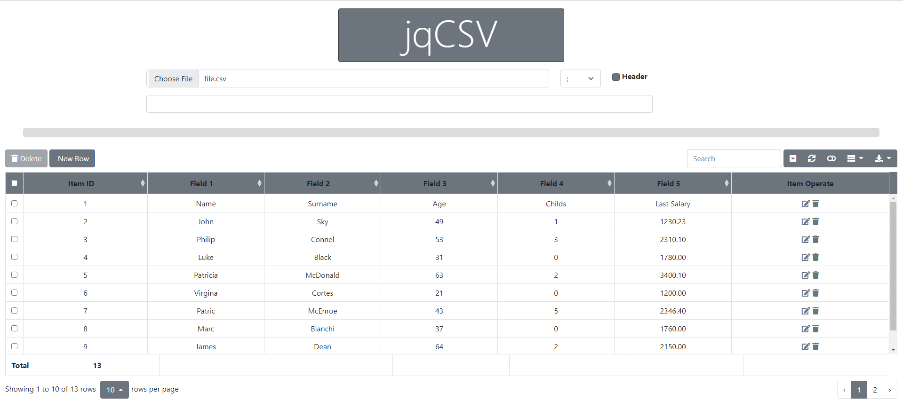
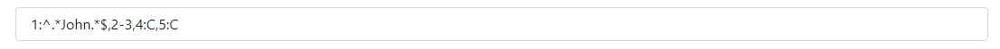
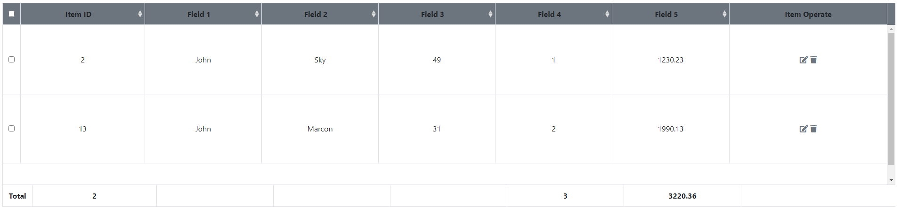

# jqCSV

----

## Description :

jqCSV is a html client utility to manage csv files, permits to read, filter, modify rows, add new rows, delete rows, export file csv in JSON, XML, CSV, TXT, SQL and MS-Excel.    

  

Tools presents a input field to insert commands to filter columns.

Posible Syntaxs are :

<Column Number>  
<Column Number from>-<Column Number to>  
<Column Number>:[<Regular Expression or 'C' for sum columns values>]   

Column Number starts from 1.
Second parameter it's not necessary.  

For example in a csv with 5 Columns I select only rows with :

       1 columns contains John
       columns 2 and 3
       Sum columns values of columns 4 and 5 

  

Rows Selected :

    

----

## Built With :

Visual Code Editor  
jquery 3.6.0  
Bootstrap 5  
bootstrap-table 1.18.3

## Authors

* **Giovanni Palleschi** - [gpalleschi](https://github.com/gpalleschi)  

## Prerequisites :

----

## License :

This project is licensed under the GNU GENERAL PUBLIC LICENSE 3.0 License - see the [LICENSE](LICENSE) file for details